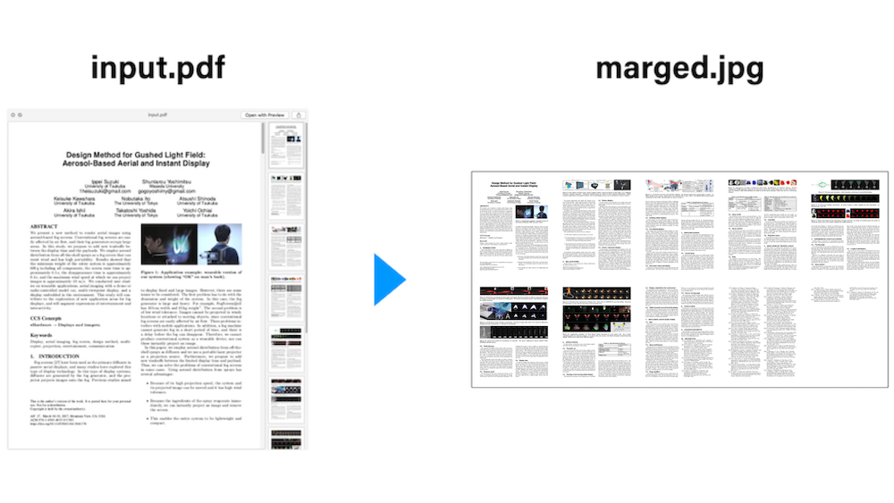

# 概要
複数ページのPDFをサムネイルにするスクリプト。  
論文などを自分のサイトに載せる時のサムネイル，全体像の確認などに使えます。


# 使い方
## macにImageMagickをインストール
brew などお好みで
`brew install imagemagick`

## generate.sh と同じディレクトリに処理したいPDFを置く
下記の例の場合， `input.pdf` が入力PDFです
```
.
├── README.md
├── generate.sh
└── input.pdf
```

## 実行
`sh generate.sh [入力PDFファイル名] [横の枚数] [縦の枚数]`  
  
例: `sh generate.sh input.pdf 5 5`  
結果:  


例: `sh generate.sh input.pdf 4 3`  
結果:  


## 注意点
- 指定した 横枚数x縦枚数x1以上のページ数を持つPDFを入力すると，複数枚結果が生成されます。

# Future Work
- ファイル形式・圧縮率・解像度の指定対応
- ページごとにボーダーを入れる
- よしなな横枚数・縦枚数で自動生成する


# 参考サイト
- pdfをページごとにpngファイルに変換 | rakkyooの備忘録  
[http://rakkyoo.net/?p=1384](http://rakkyoo.net/?p=1384)
- 複数の画像をタイル状に結合して１枚にするスクリプト | 星印のメモ  
[http://hosimemo.com/?p=146](http://hosimemo.com/?p=146)
- mac にImageMagickをインストールし、convertコマンドで画像を縮小する。 [https://qiita.com/sowd/items/832594dd22d99aebc8a2](https://qiita.com/sowd/items/832594dd22d99aebc8a2)